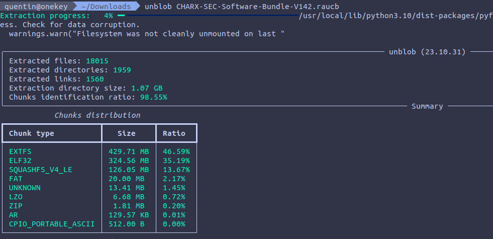
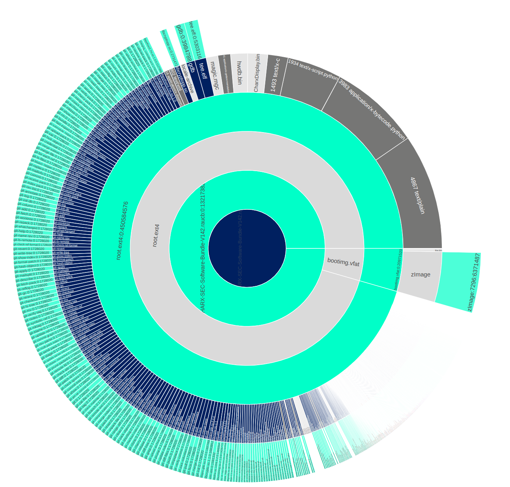
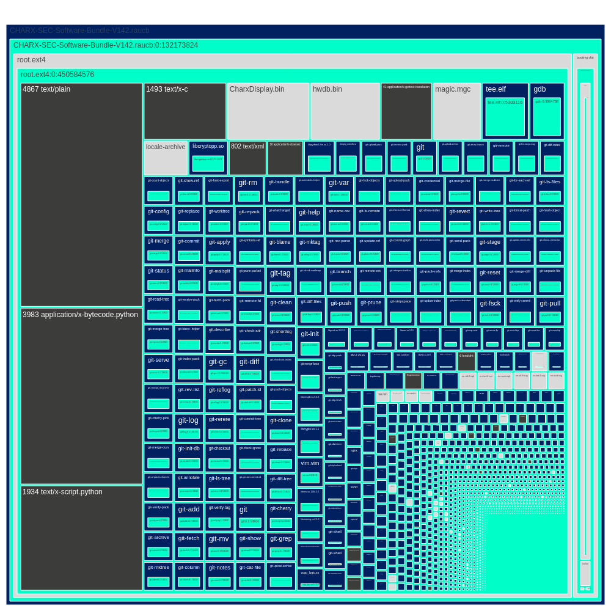
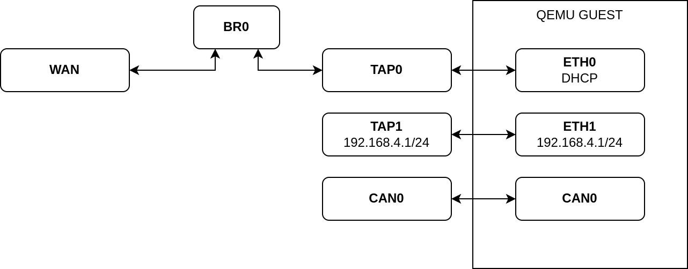
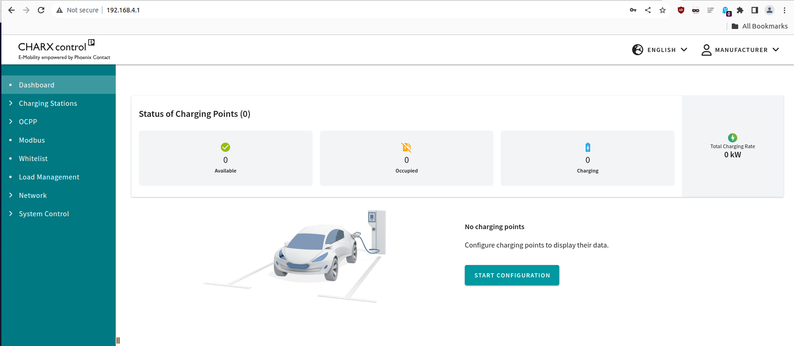

# Hands-on Firmware Extraction, Exploration, and Emulation

Join us for this hands-on demo of Unblob, the flexible firmware extractor. In
this Arsenal lab session, we will extract firmware from an EV charger, dig into
the firmware, and eventually emulate it so we can interact with the services in
real-time. Unblob works on both hardware and downloadable versions of firmware
so we have a target rich environment. No prior experience needed, this session
is appropriate for all skillsets and we are looking forward to see you there.

## Our target

Our target is an electric vehicle charging station controller from Phoenix
Contact. You can find more details about it
[here](https://www.phoenixcontact.com/en-be/products/ac-charging-controller-charx-sec-3100-1139012).

> CHARX control modular, AC charging controller, with Embedded Linux system, IEC 61851-1, operating mode: Stand-Alone, Client, Server,
>
> Interfaces:
> - Ethernet (2x)
> - Cellular communication (4G/2G)
> - CHARX control modular system bus
> - MICRO-USB type C
> 
> Communication protocols:
> - OCPP 1.6J
> - Modbus/TCP
> - MQTT
>
> Connectable peripheral devices:
> - Energy meter
> - RFID
> - DC residual current detection
> - DIN rail mounting

## Pre-requisites

There's a few tools that we need in this workshop. You can install them by
running the `install-prerequisites` script like this:

```sh
./install-prerequisites
```

## Obtaining the firmware

The firmware can be obtained from the vendor website. There is a script named
`download-firmware` in this repository that you use to pull the firmware
without the need to open a browser.

Our focus today is on the vendor provided firmware since it contains everything
we need. But a similar workflow can be applied to a memory dump extracted from
a live device. The interesting thing here is that we can extract, explore, and
emulate without even needing a real device.

## Extraction with Unblob

Let's start by making sure all the dependencies are available:

```
unblob --show-external-dependencies
The following executables found installed, which are needed by unblob:
    7z                          ✓
    debugfs                     ✓
    jefferson                   ✓
    lz4                         ✓
    lziprecover                 ✓
    lzop                        ✓
    sasquatch                   ✓
    sasquatch-v4be              ✓
    simg2img                    ✓
    ubireader_extract_files     ✓
    ubireader_extract_images    ✓
    unar                        ✓
    zstd                        ✓
```

Now we can extract the firmware with unblob:

```
unblob CHARX-SEC-Software-Bundle-V142.raucb
```

Extraction takes around 3 minutes on a decent laptop. You should see a progress bar moving up:




Once extraction is done, a directory named
`CHARX-SEC-Software-Bundle-V142.raucb_extract` should be visible. You can head
into it and list the content.

### Chunks, Unknown Chunks

Unblob works by identifying chunks of data within files. If a chunk is a
compressed stream, it gets decompressed. If it's a filesystem or an archive it
gets extracted. If the extraction or decompression was successful, the chunk
that was carved to disk is deleted to regain space.

Here, a SquashFS version 4 little-endian chunk was carved to disk, extracted,
and deleted. Files (and therefore extraction directories) are named with
`{start_offset}-{end_offset}.{type}` nomenclature.

We can see that 11KB of "unknown" chunk appears after the squashfs filesystem.

```
./0-132173824.squashfs_v4_le_extract
./132173824-132184833.unknown
```

You can run `binwalk` on it to see what it contains:

```
binwalk 132173824-132184833.unknown 

DECIMAL       HEXADECIMAL     DESCRIPTION
--------------------------------------------------------------------------------
0             0x0             Object signature in DER format (PKCS header length: 4, sequence length: 10997
58            0x3A            Certificate in DER format (x509 v3), header length: 4, sequence length: 4372
4434          0x1152          Certificate in DER format (x509 v3), header length: 4, sequence length: 4387
```

You can check the certificates with openssl:

```
dd if=132173824-132184833.unknown bs=1 skip=58 | openssl x509 -in /dev/stdin -inform der -noout -text
dd if=132173824-132184833.unknown bs=1 skip=4434 | openssl x509 -in /dev/stdin -inform der -noout -text
```

This means firmwares are probably signed with the vendor private key so devices
can make sure firmwares are authentic.

That's one of the advantage of unblob, turning unknown unknowns into known
unknowns that can be investigated.

### Filesystems

Let's look at the content of our squashfs filesystem:

```
ls -al 0-132173824.squashfs_v4_le_extract
total 460532
drwxrwxr-x  4 kali kali      4096 dec  5 09:51 .
drwxrwxr-x  3 kali kali      4096 dec  5 09:51 ..
-rw-rw-r--  1 kali kali  20971520 sep  8 09:59 bootimg.vfat
drwxrwxr-x  3 kali kali      4096 dec  5 09:51 bootimg.vfat_extract
-rwxrwxr-x  1 kali kali      2654 sep 19  2022 hook
-rw-rw-r--  1 kali kali       442 sep  8 09:59 manifest.raucm
-rw-rw-r--  1 kali kali 450584576 sep  8 09:59 root.ext4
drwxrwxr-x 22 kali kali      4096 sep  8 09:57 root.ext4_extract
```

We can see a plaintext manifest, a shell script, one MBR and an EXT4 filesystem:

```
find -maxdepth 1 -type f -exec file {} \;
./manifest.raucm: ASCII text
./hook: a /usr/bin/env sh script, ASCII text executable
./bootimg.vfat: DOS/MBR boot sector, code offset 0x3c+2, OEM-ID "mkfs.fat", sectors/cluster 4, reserved sectors 4, root entries 512, sectors 40960 (volumes <=32 MB), Media descriptor 0xf8, sectors/FAT 40, sectors/track 63, heads 255, hidden sectors 163158016, reserved 0x1, serial number 0xd09aad9c, label: "KERNEL     ", FAT (16 bit)
./root.ext4: Linux rev 1.0 ext4 filesystem data, UUID=8ed19606-02c4-42e7-9cfb-1a2839f93ec4 (extents) (large files) (huge files)
```

Both `bootimg.vfat` and `root.ext4` were handled and extracted by unblob. The
VFAT partition contains everything related to boot and OS (Linux kernel, DTB,
TEE):

```
oftree:                    Device Tree Blob version 17, size=27469, boot CPU=0, string block size=1657, DT structure block size=25756
tee.bin:                   data
zImage:                    Linux kernel ARM boot executable zImage (little-endian)
zImage-imx6ul-ksp0632.dtb: Device Tree Blob version 17, size=27469, boot CPU=0, string block size=1657, DT structure block size=25756
```

You'll see that unblob is a bit greedy and will extract an ELF file and a CPIO
archive from the Linux kernel (`zImage`), these corresponds to the minimal
kernel and ramdisk.

The EXT4 filesystem contains the root filesystem that's mounted by the Linux
kernel at boot:

```
ls -alh root.ext4_extract 
total 88K
drwxrwxr-x 22 kali kali 4,0K sep  8 09:57 .
drwxrwxr-x  4 kali kali 4,0K dec  5 09:51 ..
drwxrwxr-x  2 kali kali 4,0K dec  5 09:51 bin
drwxrwxr-x  3 kali kali 4,0K dec  5 09:51 boot
drwxrwxr-x 16 kali kali 4,0K sep  8 09:56 data
drwxrwxr-x  2 kali kali 4,0K jul 18 00:09 dev
drwxrwxr-x 53 kali kali 4,0K dec  5 09:51 etc
drwxrwxr-x 18 kali kali 4,0K sep  8 09:56 home
drwxrwxr-x  2 kali kali 4,0K jul 18 03:13 identity
drwxrwxr-x  9 kali kali 4,0K dec  5 09:51 lib
drwxrwxr-x  2 kali kali 4,0K jul 18 03:14 log
drwxrwxr-x  2 kali kali 4,0K sep  8 09:57 lost+found
drwxrwxr-x  2 kali kali 4,0K jul 18 00:09 media
drwxrwxr-x  2 kali kali 4,0K jul 18 00:09 mnt
drwxrwxr-x  2 kali kali 4,0K jul 18 00:09 proc
drwxrwxr-x  2 kali kali 4,0K sep  8 09:57 run
drwxrwxr-x  2 kali kali 4,0K dec  5 09:51 sbin
drwxrwxr-x  2 kali kali 4,0K jul 18 03:14 sdcard
drwxrwxr-x  2 kali kali 4,0K jul 18 00:09 sys
drwxrwxrwx  2 kali kali 4,0K jul 18 00:09 tmp
drwxrwxr-x 11 kali kali 4,0K sep  8 09:56 usr
drwxrwxr-x 11 kali kali 4,0K dec  5 09:51 var
```

## Exploration

### Firmware visualization

Let's do a bit of exploration by using a different set of unblob's options:

```
unblob -e /tmp/out -f -k -d 3 --report /tmp/report.json \
--log /tmp/unblob.log CHARX-SEC-Software-Bundle-V142.raucb
```

Here we keep extracting (`-e`) to `/tmp/out` but we force (`-f`) overwrite
while keeping (`-k`) carved out chunks but limiting recursion depth (`-d`) to
3. We write a detailed report (`--report`) to `/tmp/report.json` and log file
(`--log`) to `/tmp/unblob.log`.

Take a look at the log file, you'll see the inner working of unblob.

The report file contains detailed information about analyzed files (size, file
type, path, magic, mime-type, MD5/SHA1/SHA256 hashes), chunks (size, offsets,
entropy distribution) and tasks (extraction, decompression, carving). It's
possible to generate nice visualizations out of these report files with a bit
of Python.

You can create them yourself with the `diagram.py` python script available in
this repo:

```
python3 diagram.py /tmp/report.json sunburst
python3 diagram.py /tmp/report.json treemap
```

These commands will open up the browser to a page that contains a plotly based
visualization like the ones below:





## Information Gathering

Now that we have a better sense of what's inside, it's time to list what we
need to perform proper emulation of the device.

Ideally, we need to gather these pieces of information:

1. Platform
<details><summary>spoiler</summary>Phytec phyBOARD-Segin i.MX6 UltraLite</details>
2. Architecture
<details><summary>spoiler</summary>ARMv6</details>
3. CPU
<details><summary>spoiler</summary>Cortex-A7</details>
4. Bootloader
<details><summary>spoiler</summary>U-Boot</details>
5. Operating System version
<details><summary>spoiler</summary>Linux version 4.14.93</details>
6. Peripherals
<details><summary>spoiler</summary>2 Ethernet interfaces, 1 CANUSB, 1 USB OTG</details>

### Device Tree Blobs

To get some details about the platform, CPU, and architecture, we can look into
the device tree blobs embedded in the firmware.

In the VFAT partition, we have these DTBs:

```
oftree: Device Tree Blob version 17, size=27469, boot CPU=0, string block size=1657, DT structure block size=25756
zImage-imx6ul-ksp0632.dtb: Device Tree Blob version 17, size=27469, boot CPU=0, string block size=1657, DT structure block size=25756
```

These files are binary representation of device trees. We can recover their
plaintext source by using `device-tree-compiler`:

```
dtc -I dtb -o zImage-imx6ul-ksp0632.dts zImage-imx6ul-ksp0632.dtb         
dtc -I dtb -o oftree.dts oftree
```

Take a look at the DTS, and you'll soon find interesting details like the model:

```
/dts-v1/;

/ {
	#address-cells = <0x01>;
	#size-cells = <0x01>;
	model = "Phytec phyBOARD-Segin i.MX6 UltraLite"; <----- right here
	compatible = "phytec,imx6ul-pbacd-10\0phytec,imx6ul-pcl063\0fsl,imx6ul";
```

The CPU:

```
cpus {
    #address-cells = <0x01>;
    #size-cells = <0x00>;

    cpu@0 {
        compatible = "arm,cortex-a7"; <---- here
        device_type = "cpu";
        reg = <0x00>;
        clock-latency = <0xee6c>;
        operating-points = <0xa9ec0 0x137478 0x80e80 0x11edd8 0x60ae0 0xfa3e8 0x30570 0xe7ef0>;
        fsl,soc-operating-points = <0xa9ec0 0x137478 0x80e80 0x11edd8 0x60ae0 0x11edd8 0x30570 0x11edd8>;
        clocks = <0x01 0x5d 0x01 0x1a 0x01 0x26 0x01 0xdb 0x01 0x38 0x01 0x39 0x01 0x19>;
        clock-names = "arm\0pll2_bus\0pll2_pfd2_396m\0secondary_sel\0step\0pll1_sw\0pll1_sys";
        arm-supply = <0x02>;
        soc-supply = <0x03>;
        dc-supply = <0x04>;
    };
};
```

Or even peripherals:

```
--snip--
ethernet@2188000 {
    compatible = "fsl,imx6ul-fec\0fsl,imx6q-fec";
    reg = <0x2188000 0x4000>;
    interrupts = <0x00 0x76 0x04 0x00 0x77 0x04>;
    clocks = <0x01 0x90 0x01 0x91 0x01 0x30 0x01 0x2c 0x01 0x2c>;
    clock-names = "ipg\0ahb\0ptp\0enet_clk_ref\0enet_out";
    fsl,num-tx-queues = <0x01>;
    fsl,num-rx-queues = <0x01>;
    status = "okay";
    pinctrl-names = "default";
    pinctrl-0 = <0x23>;
    phy-mode = "rmii";
    phy-handle = <0x24>;

    mdio {
        #address-cells = <0x01>;
        #size-cells = <0x00>;

        ethernet-phy@1 {
            reg = <0x01>;
            interrupt-parent = <0x0b>;
            interrupts = <0x02 0x08>;
            micrel,led-mode = <0x01>;
            clocks = <0x01 0x2c>;
            clock-names = "rmii-ref";
            status = "okay";
            linux,phandle = <0x24>;
            phandle = <0x24>;
        };

        ethernet-phy@2 {
            reg = <0x03>;
            micrel,led-mode = <0x01>;
            clocks = <0x01 0x2d>;
            clock-names = "rmii-ref";
            status = "okay";
            linux,phandle = <0x13>;
            phandle = <0x13>;
        };
    };
};

--snip--
flexcan@2090000 {
    compatible = "fsl,imx6ul-flexcan\0fsl,imx6q-flexcan";
    reg = <0x2090000 0x4000>;
    interrupts = <0x00 0x6e 0x04>;
    clocks = <0x01 0x94 0x01 0x95>;
    clock-names = "ipg\0per";
    status = "okay";
    pinctrl-names = "default";
    pinctrl-0 = <0x0f>;
    xceiver-supply = <0x10>;
};

flexcan@2094000 {
    compatible = "fsl,imx6ul-flexcan\0fsl,imx6q-flexcan";
    reg = <0x2094000 0x4000>;
    interrupts = <0x00 0x6f 0x04>;
    clocks = <0x01 0x96 0x01 0x97>;
    clock-names = "ipg\0per";
    status = "disabled";
};
```

### Linux kernel version information

We can identify the Linux kernel version by grepping within the VFAT partition
that contains the compressed kernel:

```
grep 'Linux version' . -ra 
./zImage_extract/7296-6371487.lzo_extract/7296-6371487:
Linux version 4.14.93 (oe-user@oe-host) (gcc version 8.3.0 (GCC)) #1 SMP PREEMPT
./zImage_extract/7296-6371487.lzo_extract/7296-6371487:
Linux version %s (%s)Bluetooth subsystem version %u.%uHCI socket registration failed
```

Another way is to look at kernel modules within the EXT4 root filesystem:

```
modinfo ./root.ext4_extract/lib/modules/4.14.93/kernel/net/bridge/bridge.ko
filename:       ./root.ext4_extract/lib/modules/4.14.93/kernel/net/bridge/bridge.ko
alias:          rtnl-link-bridge
version:        2.3
license:        GPL
srcversion:     5DED70120EE65F8CE785272
depends:        stp,llc
intree:         Y
name:           bridge
vermagic:       4.14.93 SMP preempt modversions ARMv6 p2v8 
```


## Emulation

We may already have a compiled kernel within the firmware package, but this
kernel is compiled specifically for a particular machine (the Phytec
phyBOARD-Segin i.MX6 UltraLite). 

To use this kernel properly, we would need to be able to run this kernel on an
emulation of that exact machine that it’s compiled for. This is time-intensive
if it’s not already listed in the QEMU machines list. Note: an evaluation board
machine is available in QEMU (`mcimx6ul-evk - Freescale i.MX6UL Evaluation Kit
(Cortex-A7)`) but does not exactly match.

Instead, in theory, we can pick a QEMU machine, and use various metadata we
find in the firmware image to configure and build a kernel for that machine,
which would also be able to run everything in our filesystem, as close to the
original as possible.

From here, we have a few options:
- *user space emulation*: We could boot into our own custom ramfs/rootfs, then
  load the target firmware rootfs and chroot into it to emulate.
- *full system emulation*: We could try to boot the target firmware rootfs
  directly (passing it to the QEMU machine directly).

User space emulation is usually limiting but a great way to investigate, debug,
and exploit specific binaries. We strongly recommend you have a look at
[EMUX]() from Saumil Shah for all your userspace emulation needs.

Regardless, we still need a kernel which will boot within a QEMU machine, which
matches what the target firmware is expecting, as closely as possible.

### QEMU machines

There’s only a few candidates for general-purpose machines that offer
flexibility. After quite some experimentation, `virt`
(https://qemu.readthedocs.io/en/latest/system/arm/virt.html) seems to have a
good flexibility/power ratio for our purposes. 

When building the kernel for a given QEMU machine, it’s probably best for us to
ensure that we can use the general virtio device that QEMU bundles. In the
config, these might mean one or more of the following:

```
CONFIG_VIRTIO=y
CONFIG_SCSI_VIRTIO=y
CONFIG_VIRTIO_PCI=y
CONFIG_VIRTIO_BLK=y
```

And more! This list is incomplete.

### Building a "close-enough" kernel

It’s beneficial for us to use a kernel which has an identical (or at least very
similar) vermagic string. All kind of components within a system might be
checking the kernel vermagic, and failing if it’s different than what is
expected. This is most common in kernel modules - a kernel will usually refuse
to load a module which does not have a vermagic which matches its own. While we
can patch the kernel to ignore this at the kernel level, we still need the
initial “kernel release” part of the string to match the kernel modules'
release string, since it’s used as the search path for the modules.dep.

In the Phoenix Contact firmware, the vermagic is `4.14.93 SMP preempt modversions ARMv6 p2v8`.

The vermagic string is in a format like (from `include/linux/vermagic.h`):

```c
#define VERMAGIC_STRING 						\
	UTS_RELEASE " "							\
	MODULE_VERMAGIC_SMP MODULE_VERMAGIC_PREEMPT 			\
	MODULE_VERMAGIC_MODULE_UNLOAD MODULE_VERMAGIC_MODVERSIONS	\
	MODULE_ARCH_VERMAGIC
```

- Kernel release = the kernel version + `CONFIG_LOCALVERSION` string.
- SMP = `CONFIG_SMP`
- PREEMPT = `CONFIG_PREEMPT`
- mod_unload = `CONFIG_MODULE_UNLOAD`
- modversions = `CONFIG_MODVERSIONS`
- ARMv6 p2v8 = `MODULE_ARCH_VERMAGIC` (related to the architecture that the kernel is compiled for, therefore related to the compiler/arch option passed.)

 Once we have the extracted kernel source, we can patch it so that it’s not so brutal in comparing the vermagic strings. In kernel/module.c, we can just comment out return -ENOEXEC:

```diff
} else if (!same_magic(modmagic, vermagic, info->index.vers)) {
    pr_err("%s: version magic '%s' should be '%s'\n", info->name, modmagic, vermagic);
-   return -ENOEXEC;
+    // return -ENOEXEC;
}

if (!get_modinfo(info, "intree")) {
```

It may not necessarily be useful in the long run, but it’s good for testing, as
long as there’s slight discrepancies between our kernel vermagic and the module
vermagic. The modules (will mostly) still load.

NOTE: here we provide an already built kernel that matches the target
requirements so you don't need to compile one yourself. It was built with an
in-house script that:

- pulls the kernel source corresponding to the version we need
- calls `multi_v7_defconfig` to set initial config
- patch the vermagic checking code in `kernel/module.c`
- patch the config to enable all `VIRTIO` options and specific subsystems like
  USB or CANBUS
- build the kernel

### Minimal bootup

Let's go over the different parameters of our `qemu-system-arm` command. We provide the kernel this way:

```sh
qemu-system-arm -M virt,highmem=off \
  -m ${AVAILABLE_MEM_GB}G -smp ${CPU_CORES} -cpu cortex-a15 \
  -kernel zImage
```

The EXT4 filesystem image is attached as a SCSI disk:

```sh
-device virtio-scsi-device \
-device scsi-hd,drive=SystemDisk \
-drive file=${FIRMWARE_IMAGE},format=raw,if=none,id=SystemDisk
```

We set a proper console output this way:

```sh
-append "${BOOT_PARAMS}" \
-no-reboot \
-nographic \
-serial mon:stdio \
```

The `BOOT_PARAMS` are set in `config.ini` and corresponds to the actual kernel
bootcmd, with two small adaptations (console path and rootfs path).

### Networking

Now that we have a working emulated system, it's time to set up networking. The target has the following:
- two Ethernet interfaces (`eth0` and `eth1`)
- one CANbus interface (`can0`)
- one USB interface that can act as Ethernet over USB (`usb0`)
- a Qualcomm High Sierra cellular modem (`ppp0`)

Emulating cellular modem and USB interfaces is a pain with QEMU, and not really
required for the device operation since those interfaces are "optional". The
CAN interface is there to allow the controller to talk to other controllers or
charging stations. The `eth0` interface provides upstream connectivity by
requesting a DHCP lease by default while `eth1` is set to 192.168.4.1 and is
there if you want to daisy chain multiple controllers.

The ethernet interfaces are set as TAP interfaces and attached like this:

```
-netdev tap,id=tap0net,ifname=${ETH_1},script=no,downscript=no \
-device virtio-net-device,netdev=tap0net,mac=${ETH_1_MAC} \
-netdev tap,id=tap1net,ifname=${ETH_0},script=no,downscript=no \
-device virtio-net-device,netdev=tap1net,mac=${ETH_0_MAC} \
```

The CANBUS interface is simply a PCI interface, attached like this:

```
-object can-bus,id=canbus0 \
-device kvaser_pci,canbus=canbus0 \
-object can-host-socketcan,id=canhost0,if=can0,canbus=canbus0 \
```

The diagram below present what the network setup looks like:



If you wanted to try inter-controller communication by daisy-chaining them as
recommended by Phoenix Contact, you could use something like this:


## Ready ? Set. Launch !

Now that everything is in place, it's time to boot it up !

First, you need to setup all the network interfaces like this:

```
sudo ./ifup.sh
```

Make sure that your upstream interface is correctly set in `config.ini`:

```
# interface will be transparently bridged
OUT_IF="eth0" 
```

You can then launch the emulator:

```
sudo ./launch.sh
```

You'll see the obtained addresses in the logs:

```
Dec  5 10:07:46 ev3000 daemon.info avahi-daemon[1047]:
Registering new address record for 192.168.4.1 on eth1.IPv4.
Dec  5 10:07:46 ev3000 daemon.info avahi-daemon[1047]:
Registering new address record for 192.168.88.181 on eth0.IPv4.
```

### Access over SSH

You can then SSH into the emulated device using the `user-app` user:

```sh
ssh user-app@192.168.4.1
```

The password is "user". You'll be forced to change it on first login:

```sh
ssh user-app@192.168.88.181
The authenticity of host '192.168.88.181 (192.168.88.181)' can't be established.
ED25519 key fingerprint is SHA256:qMupzEehNFpx6eaGZ4d3AY5Jlms3Pmxh3/yg9OGA28o.
This key is not known by any other names
Are you sure you want to continue connecting (yes/no/[fingerprint])? yes
Warning: Permanently added '192.168.88.181' (ED25519) to the list of known hosts.
user-app@192.168.88.181's password: 
WARNING: Your password has expired.
You must change your password now and login again!
Changing password for user-app
Old password: 
Enter the new password (minimum of 5 characters)
Please use a combination of upper and lower case letters and numbers.
New password: 
Re-enter new password: 
passwd: password changed.
Connection to 192.168.88.181 closed.
```

### Web Interface

You can access the web interface at http://192.168.4.1. It may show an error
message while the device is booting up. Once everything is up and running you
should see this: 



You can login with the following accounts:

| username | password |
|----------|----------|
| manufacturer | manufacturer |
| operator | operator |


### CAN traffic

When everything is up and running you can capture CAN traffic emitted by the
controller:

```
candump -i can0
  can0  701   [1]  00000101
  can0  701   [1]  00000101
  can0  701   [1]  00000101
  can0  701   [1]  00000101
  can0  701   [1]  00000101
  can0  701   [1]  00000101
```

NOTE: it appears QEMU version 8.x has some difficulties attaching the CAN
controller for some reason.
